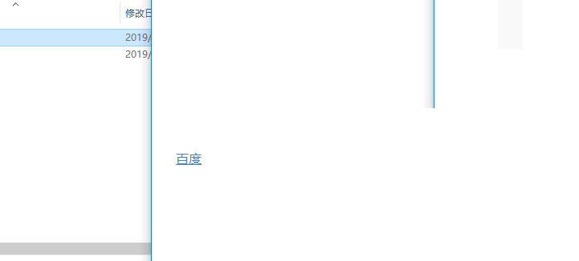
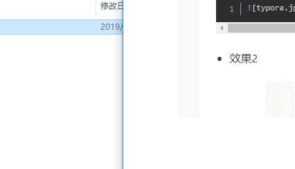

[TOC]

# 一级标题

## 大家四六级

### 收到家乐福


> 引用内容1
>
> 引用内容2
>
> > 引用内容3


` String str = 'hello'  `     单行代码


多行代码

```python
def main():
	print('hello world')
```


无序列表

- 哈哈哈
  - 随机发
    - 的数据发链接
- 上点击链接
- 大家发牢骚


有序列表

1. 有序
   1. 沙发里家乐福
      1.  jflkaj
2. 圣诞节就是
3.  解放路吉林省


| 姓名       | 年龄 |
| ---------- | ---- |
| 都是放假啊 | 232  |
| 大         | 22   |


t图片


[百度][www.baidu.com]








## 二级标题


### 三级标题


#### 四级标题


##### 五级标题


###### 六级标题

